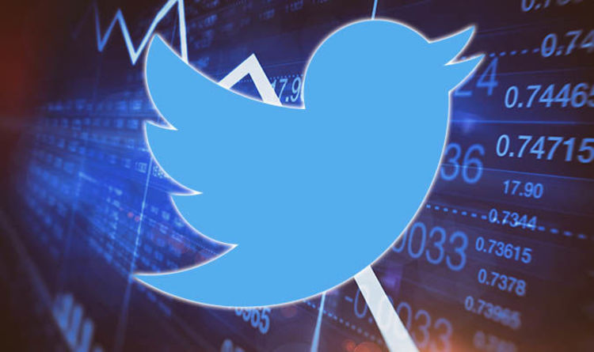
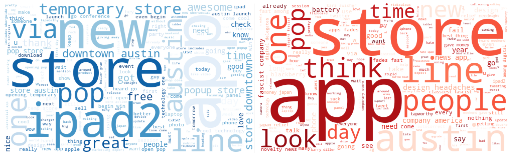

# Natural Language Processing (NLP) Twitter Sentiments
## Conducting a Twitter sentiment analysis for Apple products
#### Authors: Qi Cai, Alex Karadjov

## Overview

In today's interconnected world, social media has a profound impact not only on individuals but also on businesses' day-to-day operations. It has become essential for companies to understand public opinion about their products and brand, and swiftly adapt to changing trends in order to stay relevant and achieve financial success.

Major companies like Apple and Google leverage events like Apple's WWDC and Google's I/O to unveil new products, and software updates, and share their future visions. These events provide valuable opportunities for marketing teams to assess interest and gather insights from the public. Additionally, conferences attended by senior leadership offer chances to engage with fans and provide glimpses of what lies ahead. These occasions are ideal for companies to monitor public sentiment and gauge the reception of their announcements.

Among the various mediums available, Twitter stands out as a powerful resource for businesses to understand public opinion. With millions of users sharing their thoughts on diverse topics every day, Twitter provides a wealth of information for companies. In this project, we have been contracted by Apple to conduct sentiment analysis on tweets related to the SXSW (South by Southwest) Conference. Our analysis will address the following key questions:

What specific aspects of Apple products are mentioned in tweets expressing positive and negative sentiments? 

Can we extract valuable insights from the tweets to understand customer preferences, product pain points, or areas for improvement?

Stakeholder: Apple Marketing and Product Development Teams

## Goals

Our team's goal is to extract useful info from tweets on Apple products and explore the emotion distribution within each target product, with that emotion being either positive or negative.

By locking in on these specifications we are able to identify any pain points or repetitive results in a negatively directed manner, towards any target products and provide insight for any improvements or enhancements that Apple can move forward based on the public view.

Utilize the dataset to build a brand sentiment analysis model. Train a machine learning or deep learning model using the labeled tweets as input and their corresponding sentiment (positive or negative) as the output. 

## Data

We used a dataset from [data.world](https://data.world/crowdflower/brands-and-product-emotions), and the tweet analysis within the dataset is created and collected by Appen. This data set contains over 9,000 tweets about Apple and Google. The tweet labels were generated through crowdsourcing and indicate the specific emotion conveyed as well as the product, service, or company to which that emotion is directed, based on the content of the tweets.

## Methods

In the first step, we prepared our data. We started off by understanding the data and cleaning the data. There were a lot of missing values in the brand/product column so we came up with a loop to assign them to certain product names based on the tweet content. For the emotion column, we assigned "No emotion" to neutral. We also feature-engineered a column "Brand" assigning brands Google, Apple, and Unknown to each tweet.

In the second step, we started our EDA process along with WordCloud for visualization.
During the EDA process, we mainly focus on positive and negative tweets for Apple products since that was our business goal. we started by looking into Apple and later dived deep into iPhone and iPad to extract specific pain points of target products. To use WordCloud, we went over very similar steps as NLP preprocessing. We first tokenized the tweets, then removed customized stopwords and punctuations, then lemmatized, and then vectorized using TfidfVectorizer.

Lastly, we moved on to modeling. 
We defined our target as positive or negative emotions. Features are tokenized words from tweets.
We started off by creating a pipeline for a dummy classifier as our baseline model, the pipeline includes preprocessing steps, SMOTE for class imbalance in our dataset, and instantiating the model. We tried various models including random forest, logistic regression classifier, Decision Tree, K-nearest Neighbor, and Naive Bayes classifier. Also used GridSearch to find the optimal parameters.

## Results

The best model was a logistic regression model with an accuracy score of 0.87. 

Confusion Matrix

 

ROC Curve

### Percentages of Different Sentiments for Apple

Most tweets regarding Apple products are neutral (51.9%), follow by positive (40.2%), and negative (7.9%).

### Sentiment Analysis of Apple 

### Sentiment Analysis of iPad

Positive Tweets

Negative Tweets

### Sentiment Analysis of iPhone

Positive Tweets

Negative Tweets

## Conclusions
What specific aspects of Apple products are mentioned in tweets expressing positive and negative sentiments?

Can we extract valuable insights from the tweets to understand customer preferences, product pain points, or areas for improvement?

Most tweets regarding Apple products are neutral (51.9%), follow by positive (40.2%), and negative (7.9%).

To further investigate, we used WordCloud in the EDA notebook to analyze the most frequent words among positive and negative sentiment tweets to discover informative aspects of Apple products, specifically iPhone and iPad, to further provide product enhancement areas.

iPhone - Positives & Negatives:

People enjoy new products, new apps, or phone cases, and the word ‘FREE’ has a high frequency that shows people also seem to enjoy free products/services or samplers.

For negative iPhone traits, ‘battery’ is the top frequent word. Along with ‘CHARGING’ and ‘TIME’.
It means people are probably having problems with battery life and charging time. We can also see ‘BLACKBERRY’ which we assume is from people comparing the iPhone and Blackberry but favoring the Blackberry.

iPad - Positives & Negatives:

In the iPad Positive tweets we can see the most frequent words being ‘NEW’, and ‘APP’, where people are talking about how they are enjoying new items and apps on the app store, as well as ‘FREE’ shows up again, where people are liking free apps and games.

On the other hand, negative tweets on iPad seems to focus on the design, some people even wrote that the design of the iPad was referred to as a “design headache”. And a lot of people seem to talk about the quality of the graphics on the iPad.

## Recommendations
To improve our products in the future, for iPad, we want to focus on improving the quality of its design, and the quality of the graphics, for a better runtime. For the iPhone, we definitely want to recommend improving its battery for a better battery life, and possibly updating the charging cable type for a more efficient charge. For overall enhancement on both products, we think it is ideal to look into the quality and speed of graphics for both devices and look into new possible battery prospects. We can also confidently say that giving away free products at new product promos is a good way to gain positive feedback from the public

## Our Next Step
As a team, the next step we should take is to further investigate and explore more pain points on our products, we should also try to build a model around specific pain points to further extract more useful info from the public views and also explore other company brands focusing on their product design in order to enhance our products in the future.

### Links

[Cleaning notebook](https://github.com/QiCai1995/NLP_Twitter_Sentiment/blob/main/Final_Notebooks/Cleaning.ipynb)

[EDA notebook](https://github.com/QiCai1995/NLP_Twitter_Sentiment/blob/main/Final_Notebooks/EDA.ipynb)

[Modeling notebook](https://github.com/QiCai1995/NLP_Twitter_Sentiment/blob/main/Final_Notebooks/Modeling.ipynb)

[Presentation](https://github.com/QiCai1995/NLP_Twitter_Sentiment/blob/main/Presentation.pdf)

